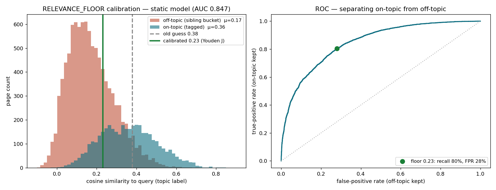

# Retrieval decisions & magic numbers

Every tunable constant in the retrieval pipeline, scrutinized and justified. The rule: a number is
either **calibrated against data**, **a documented convention**, or **a labelled UX/safety choice** —
never an unexamined guess. Reproduce the evidence with `calibrate.py`.

---

## Embedding model — `static-retrieval-mrl-en-v1` (kept, now validated)

**Decision: keep the static model. Do _not_ upgrade to a transformer.**

A transformer (bge/gte) was the obvious "upgrade", so it was tested properly. Ground truth without a
hand-labeled set: the granular topic tags (a page tagged topic *T* is about *T*'s label). Metric:
ROC-AUC of separating on-topic from off-topic pages by cosine to the topic label.

| model | as-deployed¹ | content-only² | hard / semantic-only³ |
|---|---|---|---|
| **static-retrieval-mrl-en-v1** | **0.921** | **0.884** | **0.884** |
| gte-small | 0.888 | 0.881 | 0.881 |
| bge-small-en-v1.5 | 0.874 | 0.866 | 0.866 |

¹ page text incl. the injected topic-label echo · ² label echo stripped (real semantic match) ·
³ only positives whose text never contains the label verbatim (forces semantic, not lexical, matching)

The static model **ties or beats** both transformers at *discriminating* relevant from irrelevant
pages — even on hard semantic-only positives — and is ~10–50× faster (it runs per query in the live
app). Note: bge produces higher *absolute* cosines (0.65–0.78 vs 0.44–0.53) but worse AUC; absolute
scale is irrelevant, only separation matters. A transformer also did **not** fix the motivating miss
(the euro-crisis Lego chart stayed ranked last among EMU pages under bge). Verdict: no upgrade.

Why static wins here: our pages are long and concept-dense (page text + a 300–500 word vision card).
Mean-pooled static embeddings thrive on long bag-of-concepts text; transformer attention helps most on
short, syntactically complex text — not this corpus.

Reproduce: `uv run python calibrate.py --benchmark [--hard]`

---

## `RELEVANCE_FLOOR = 0.23` (was `0.38` — recalibrated)

`enumerate` unions a topic's tagged pages, ranks them by cosine to the query, and surfaces those
**above this floor** as findings; the rest fold into the coverage count. The old `0.38` was never
calibrated (the `eval_run.py --golden` harness meant to set it was never given a filled key).

**It was set above the average on-topic page**, so it silently discarded most relevant pages:

Calibration (topic tags as ground truth; **sibling negatives** = pages in the same high-level bucket
but not the target topic, which is the topically-adjacent distinction the floor actually makes):

| | on-topic mean | off-topic mean | floor | on-topic recall | off-topic kept |
|---|---|---|---|---|---|
| old `0.38` | 0.36 | 0.17 | 0.38 | **43.8%** | 5.3% |
| new `0.23` (Youden's J) | 0.36 | 0.17 | 0.23 | **80.5%** | 28.2% |

`0.23` is the Youden's-J maximum-separation point (max TPR−FPR); it's robust to the negative set
(random negatives give 0.21, siblings 0.23). It lifts recall from ~44% → ~80%. The extra surfaced
pages land as *supporting* findings (top-6 stay *primary*; the UI tucks supporting behind disclosure),
so recall rises without cluttering the primary view, and `MAX_ENUMERATE=500` caps the total. This tool
is recall-first by design (the user's complaint was misses), so erring toward recall is correct.

Reproduce: `uv run python calibrate.py --calibrate`

---

## `search` limit — default `10`, max `25` (was hard-capped at `10`)

`bounded_limit` previously clamped the *maximum* to 10, so the agent couldn't widen the pool even when
it asked. Evidence: the euro-crisis Lego chart sat at fused rank **8** under the user's phrasing but
**19–25** under reformulations — a cap of 10 made it invisible to widening passes. Default stays 10 (a
readable preview); coverage / "every chart of X" passes can request up to 25. `SEARCH_LIMIT_MAX = 25`.

---

## Angle-diverse multi-query fan-out (prompt)

A single similarity query is fragile: the same chart swings from rank **1** to rank **25** depending
on framing, because a chart is indexed under the one framing its description happens to use. The
retrieval playbook now requires coverage/chart queries to issue 3–5 reformulations across different
**analytical angles** (not just vocabulary synonyms) and union the hits. This — not a model change —
is what reliably surfaces the Lego chart (rank 1–2 under its own "blame-shifting / who pays" framing).

---

## Euro-crisis Lego chart — card enrichment + which-chart prompt rule

Third pass on the same motivating example. The prior two passes (search-limit cap → 25, angle fan-out)
were **retrieval** fixes — but a re-run showed retrieval was no longer the problem. For the query "when
did I have a chart on the dissimilarities of the countries in the EMU", the agent **already had** the
Lego chart twice: `search` returned p.915 at fused rank 11 (inside its limit-20 result), and
`find_mentions(["European Monetary Union", …])` auto-committed it. The agent still dropped it — it
snippet-picked three other candidates (p.749 cultural divide, p.1282 Countrymatch, p.4588 divergence)
to `get` and never reconsidered 915. So this was a **selection/synthesis** miss, not a recall miss.

Two changes, because the user asked for both:

1. **Card enrichment (index).** The vision card for the Lego chart described it as *burden-shifting
   among bailout actors* — accurate, but it never said the chart depicts each EMU member/institution
   as a distinct figure, so it ranked below literal "dissimilarity" charts. Appended an honest
   sentence to `cards.jsonl` for **p.915** (Sept 6 2011) and **p.4589** (the June 12 2025 reprise)
   noting each country/institution is parodied as a different Lego figure dramatizing the differences
   among the members, then rebuilt BM25+embeddings. This is index enrichment of true visual content,
   **not** a per-query regex (the thing the architecture explicitly forbids). Effect (chart_only):
   under the user's phrasing p.915 moved rank **17 → 5** and p.4589 **→ 3** (both now inside the
   default limit of 10); unrelated queries (solar/margins/tariffs) unchanged. Reproduce by re-running
   the ranking probe against the rebuilt index.

2. **Which-chart prompt rule (`SYSTEM`, NARROW section).** "When/which was the chart that did X" is
   narrow but distinct: the answer is one visual and the user describes what they *remember* (a
   metaphor, "Lego figures", "each country as a different character"), not the printed words. The rule
   tells the agent (a) a chart may be a satirical/visual-metaphor graphic, not only an axis plot; (b)
   `get` the actual page content of top candidates — including pages already auto-committed — before
   committing a verdict; (c) never finalize while a higher-ranked or already-committed chart hit sits
   un-inspected. Targets the root cause; behavioral, so validated by reasoning + the deterministic
   retrieval gain above, not a cheap automated check.

---

## Live-test fixes (find_mentions ranking, get() ergonomics, always-plan)

Found by driving the live app (Playwright) on the dissimilarity query above and watching the trace.

- **find_mentions now ranks by `q` (Primary-flood fix).** find_mentions has no ranker of its own, so
  it used a pure volume rule: ≤12 matches ⇒ all "primary". A UNION that mixed a sharp phrase with a
  generic word ("heterogeneous") then stamped 8 topically-unrelated pages (OPEB, CRE, tech, vaccines)
  as Primary right under the answer. Note df doesn't catch this — "heterogeneous" hits only 8 pages,
  so a frequency threshold won't fire; the pages are *topically* generic, not lexically common. Fix:
  find_mentions takes an optional `q` (the question subject) and ranks matches by embedding similarity
  to it, reserving "primary" for pages clearing `RELEVANCE_FLOOR` (same floor/model as enumerate). The
  8 noise pages scored <0.12 → supporting; only p.593 (0.42) and p.4104 (0.43) stayed primary. The
  prompt also now tells the agent to reserve find_mentions for DISTINCTIVE terms (names/phrases) and
  push generic words to `search`, and to always pass `q`.
- **get() lone-page ergonomics.** Models routinely send `{page:N, start:0, end:0}`; the old branch
  order treated start/end=0 as a real span and returned "p.0-p.0 → 0 pages", wasting a whole turn
  (~20s) until the model retried with `{start:N,end:N}`. Pages are 1-based, so 0 now means "unset":
  a span counts only when BOTH start and end are positive, otherwise a positive `page` wins.
- **Always plan.** The PLAN section used to let the agent skip the live checklist for narrow
  single-lookups. The checklist is part of every run's UX, so the skip clause is removed — even a
  narrow question publishes a short 2–3 step plan.
- **WHICH-CHART rule scoped to bound cost.** The first draft said "don't finalize while an
  already-committed chart hit is un-inspected"; with find_mentions auto-committing hundreds of pages
  that made the agent chase them all (one run hit 21 turns / 1.1M tokens / $0.79). Rescoped to "verify
  the top 3–5 ranked search candidates, then stop" → back to ~16 turns / $0.28. The rule also asks the
  agent to be inclusive and name a clearly-related remembered visual (e.g. the Lego diagram) alongside
  the best literal match — best-effort; the model still often answers with only the literal charts.

---

## Constants left as-is (already justified)

| constant | value | justification | risk if wrong |
|---|---|---|---|
| RRF `k` | 60 | canonical TREC default; dampens the long tail so a page strong in one ranker still surfaces | low |
| `DEFAULT_PRIMARY_K` | 6 | UX: a handful of strongest findings shown prominently, rest "supporting" | low |
| `FIND_MENTIONS_PRIMARY_MAX` | 12 | flood guard: a common phrase over-matches → mark the batch supporting | low |
| `MAX_ENUMERATE` | 500 | safety ceiling on one bulk enumeration | low |
| `MAX_SEARCH_LIMIT` | 10 | default preview depth (see search-limit section) | low |
| `MAX_TEXT_CHARS`, `EXCERPT_MAX_CHARS` (950), `EXCERPT_NEIGHBORS` (2) | — | display/preview truncation | low |
| `MAX_RUN_ATTEMPTS` (2), `RETRY_BACKOFF_S` (1.5) | — | transient-API-drop resilience | low |
