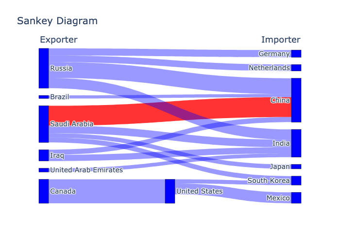

# Sankey diagrams

This script loads data from a `.csv` or `.xlsx` file using `pandas`, creates a sankey diagram using `plotly`, and saves the diagram to an image file using `kaleido`.

The plot should look like this:



on data that looks like this:

```csv
Source,Target,Value
Saudi Arabia,China,580
Russia,China,460
Saudi Arabia,India,220
Russia,India,300
Canada,United States,700
United States,Mexico,320
Iraq,China,150
Iraq,India,180
Brazil,China,90
United Arab Emirates,India,110
Saudi Arabia,Japan,130
Saudi Arabia,South Korea,140
Russia,Germany,210
Russia,Netherlands,190
United States,South Korea,120
```